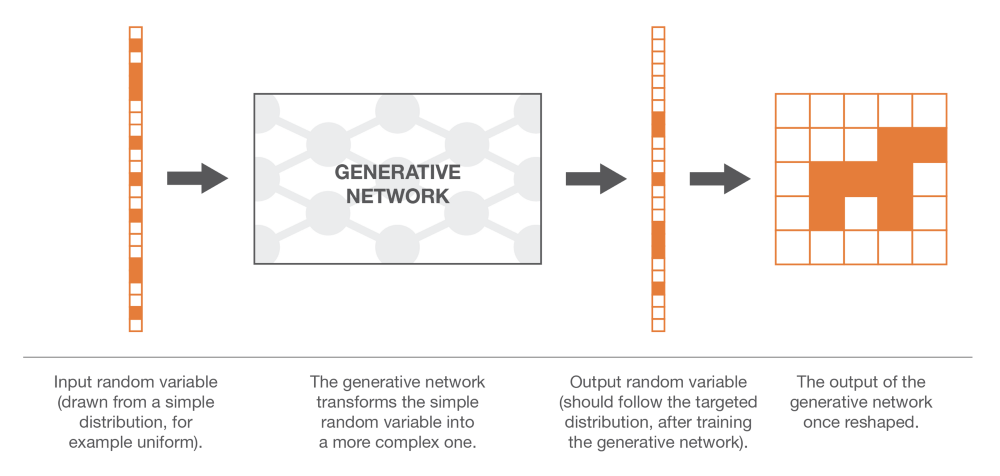
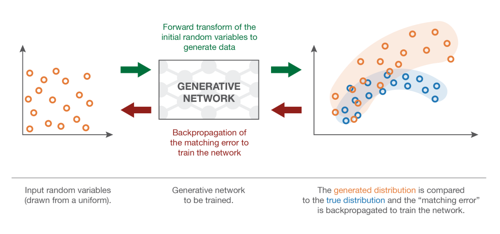
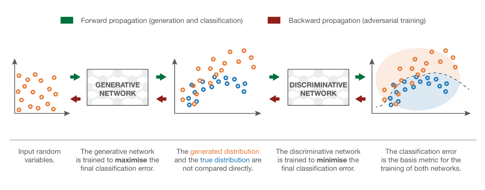

# Implementing-GANs

Generative Adversarial Networks (GANs for Short) are said to be the most interesting ideas in the last 10 years in Machine Learning. Generative Adversarial Networks belong to the set of generative models. It means that they are able to produce / to generate new content.

Illustration of GANs abilities by Ian Goodfellow and co-authors. These are samples generated by Generative Adversarial Networks after training on two datasets: MNIST and TFD. For both, the rightmost column contains true data that are the nearest from the direct neighboring generated samples. This shows us that the produced data are really generated and not only memorised by the network. (source: “Generative Adversarial Nets” paper)

## 1. Generating Random Variables
There exist different techniques that are aimed at generating more complex random variables. Among them we can find, for example, inverse transform method, rejection sampling, Metropolis-Hasting algorithm and others. All these methods rely on different mathematical tricks that mainly consist in representing the random variable we want to generate as the result of an operation (over simpler random variables) or a process.

Rejection sampling expresses the random variable as the result of a process that consist in sampling not from the complex distribution but from a well known simple distribution and to accept or reject the sampled value depending on some condition. Repeating this process until the sampled value is accepted, we can show that with the right condition of acceptance the value that will be effectively sampled will follow the right distribution.

In the Metropolis-Hasting algorithm, the idea is to find a Markov Chain (MC) such that the stationary distribution of this MC corresponds to the distribution from which we would like to sample our random variable. Once this MC found, we can simulate a long enough trajectory over this MC to consider that we have reach a steady state and then the last value we obtain this way can be considered as having been drawn from the distribution of interest.

### 1.1. The Inverse Transform Method
The idea of the inverse transform method is simply to represent our complex random variable as the result of a function applied to a uniform random variable we know how to generate. We consider in what follows a one dimensional example. Let X be a complex random variable we want to sample from and U be a uniform random variable over [0,1] we know how to sample from. We remind that a random variable is fully defined by its Cumulative Distribution Function (CDF). The CDF of a random variable is a function from the domain of definition of the random variable to the interval [0,1].

Inverse transform method is a way to generate a random variable that follows a given distribution by making a uniform random variable goes through a well designed “transform function” (inverse CDF). This notion of “inverse transform method” can, in fact, be extended to the notion of “transform method” that consists, more generally, in generating random variables as function of some simpler random variables (not necessarily uniform and then the transform function is no longer the inverse CDF). Conceptually, the purpose of the “transform function” is to deform/reshape the initial probability distribution: the transform function takes from where the initial distribution is too high compared to the targeted distribution and puts it where it is too low.

## 2. Generative Models
Suppose that we are interested in generating black and white square images of dogs with a size of n by n pixels. We can reshape each data as a N=nxn dimensional vector (by stacking columns on top of each others) such that an image of dog can then be represented by a vector. However, it doesn’t mean that all vectors represent a dog once shaped back to a square! So, we can say that the N dimensional vectors that effectively give something that look like a dog are distributed according to a very specific probability distribution over the entire N dimensional vector space (some points of that space are very likely to represent dogs whereas it is highly unlikely for some others). In the same spirit, there exists, over this N dimensional vector space, probability distributions for images of cats, birds and so on.

Then, the problem of generating a new image of dog is equivalent to the problem of generating a new vector following the “dog probability distribution” over the N dimensional vector space. So we are, in fact, facing a problem of generating a random variable with respect to a specific probability distribution.

## 3. Generative Matching Networks
the idea of GMNs is to train the generative network by directly comparing the generated distribution to the true one. However, we do not know how to express explicitly the true “dog probability distribution” and we can also say that the generated distribution is far too complex to be expressed explicitly. So, comparisons based on explicit expressions are not possible. However, if we have a way to compare probability distributions based on samples, we can use it to train the network. Indeed, we have a sample of true data and we can, at each iteration of the training process, produce a sample of generated data.
So, once we have defined a way to compare two distributions based on samples, we can define the training process of the generative network in GMNs. Given a random variable with uniform probability distribution as input, we want the probability distribution of the generated output to be the “dog probability distribution”. The idea of GMNs is then to optimise the network by repeating the following steps:

- generate some uniform inputs
- make these inputs go through the network and collect the generated outputs
- compare the true “dog probability distribution” and the generated one based on the available samples (for example compute the MMD -distance between the sample of true dog images and the sample of generated ones)
- use backpropagation to make one step of gradient descent to lower the distance (for example MMD) between true and generated distributions

As written above, when following these steps we are applying a gradient descent over the network with a loss function that is the distance between the true and the generated distributions at the current iteration.

## 4. GANs
### The 'Indirect' trianing approach.
The “direct” approach presented above compare directly the generated distribution to the true one when training the generative network. The brilliant idea that rules GANs consists in replacing this direct comparison by an indirect one that takes the form of a downstream task over these two distributions. The training of the generative network is then done with respect to this task such that it forces the generated distribution to get closer and closer to the true distribution.

The downstream task of GANs is a discrimination task between true and generated samples. Or we could say a “non-discrimination” task as we want the discrimination to fail as much as possible. So, in a GAN architecture, we have a discriminator, that takes samples of true and generated data and that try to classify them as well as possible, and a generator that is trained to fool the discriminator as much as possible.
### The ideal case : Perfect generator and discriminator
In order to better understand why training a generator to fool a discriminator will lead to the same result as training directly the generator to match the target distribution, let’s take a simple one dimensional example. We forget, for the moment, how both generator and discriminator are represented and consider them as abstract notions (that will be specified in the next subsection). Moreover, both are supposed “perfect” (with infinite capacities) in the sense that they are not constrained by any kind of (parametrised) model.

Suppose that we have a true distribution, for example a one dimensional gaussian, and that we want a generator that samples from this probability distribution. What we called “direct” training method would then consist in adjusting iteratively the generator (gradient descent iterations) to correct the measured difference/error between true and generated distributions. Finally, assuming the optimisation process perfect, we should end up with the generated distribution that matches exactly the true distribution.
### The approximation : Adversarial Neural Networks
The generator is a neural network that models a transform function. It takes as input a simple random variable and must return, once trained, a random variable that follows the targeted distribution. As it is very complicated and unknown, we decide to model the discriminator with another neural network. This neural network models a discriminative function. It takes as input a point (in our dog example a N dimensional vector) and returns as output the probability of this point to be a “true” one.
Notice that the fact that we impose now a parametrised model to express both the generator and the discriminator (instead of the idealised versions in the previous subsection) has, in practice, not a huge impact on the theoretical argument/intuition given above: we just then work in some parametrised spaces instead of ideal full spaces and, so, the optimal points that we should reach in the ideal case can then be seen as “rounded” by the precision capacity of the parametrised models.
Once defined, the two networks can then be trained jointly (at the same time) with opposite goals :
- The goal of the generator is to fool the discriminator, so the generative neural network is trained to maximise the final classification error (between true and generated data)
- The goal of the discriminator is to detect fake generated data, so the discriminative neural network is trained to minimise the final classification error

