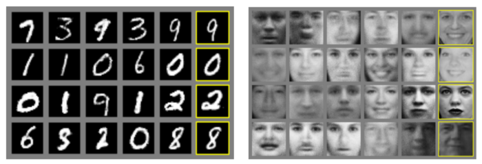

# Implementing-GANs

Generative Adversarial Networks (GANs for Short) are said to be the most interesting ides in the last 10 years in Machine Learning. Generative Adversarial Networks belong to the set of generative models. It means that they are able to produce / to generate new content.

